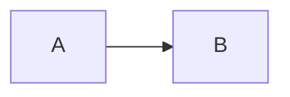

# Overview

# hyset.ComputeSettings

The general settings for a hyrun calculation are generated from hyset.
They are then appended with program and run specific information to give the
RunSettings which are then used to perform the computation

# hyset.RunSettings

koko
